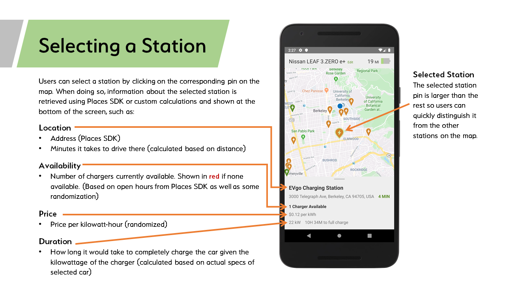

# MAP-E
### Designed and Developed by Ashley O'Neale 

* [Video](https://drive.google.com/file/d/1iLFN2HuWPpQ1Cg7oZwDQuzTvFT6BMwAa/view?usp=sharing)
* [Github Repository](https://github.com/cs160-berkeley/prog02b-fa19-aoneale)
* [Figma](https://www.figma.com/file/fChs1t4r25IYhonoCCTKbv/Prog-2?node-id=0%3A1)

MAP-E is an Android mobile app that helps owners of electric vehicles find nearby charging stations. The app makes use of Maps SDK for Android, Places SDK for Android, and Geocoding API to display a map with nearby stations and provide details about each station. 

